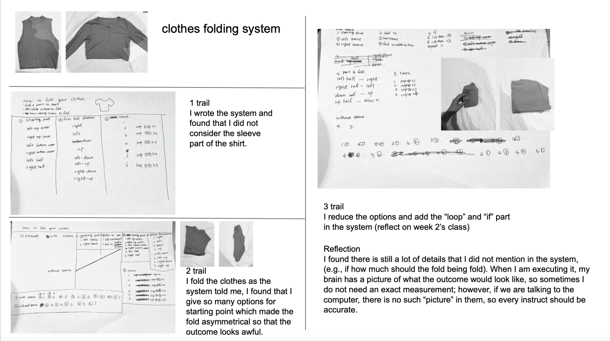

# Week 2

## 12-hour Challenge form last week.

 

“What is the algorithm? It is an instruction, a calculation, a program. For our daily exercise, like cooking is an algorithm executed by humans.”
So does painting and drawing.
At the beginning of this class, we had a task, which is to draw something and describe the step of how to bring it. Here is my example.

An then, Karen introduced some artists in this field.
Note from class.

## In-class activity

We learned how to draw with code in processing, which gives me a better understanding of how the processing is used. (create Canvas, ellipse, line, colour, if, keyPressed, mousePressed, translate)
Here is my self-portrait (interactive)

 .jpg)

And this is the one that I change other people’s code.

 .jpg)

I made it interactive by letting the eyeball changed as the mouse move. And give it blush when the key is pressed. I made a small video show how it moves with the movie maker in processing.
Link https://youtu.be/rHtb9QYsV7M

## What I learn
I learn not only how to code of drawing but also form a way of thinking. The thinking of order and making everything logically and put them in a system. I would not think about how to draw/do something with the order in my mind before. But after these two weeks of studying, this kind of way of thinking grows.

## Open processing
Eyeballs by Jones Yu 
This is the effect that I want to achieve last week for remixing other people's work.
https://www.openprocessing.org/sketch/872825

Underground Passage by Naoki Tsutae 
https://www.openprocessing.org/sketch/817108

https://www.openprocessing.org/sketch/907601

Organic
by Gábor Törőcsik-Nagy 
https://www.openprocessing.org/sketch/238882

 
